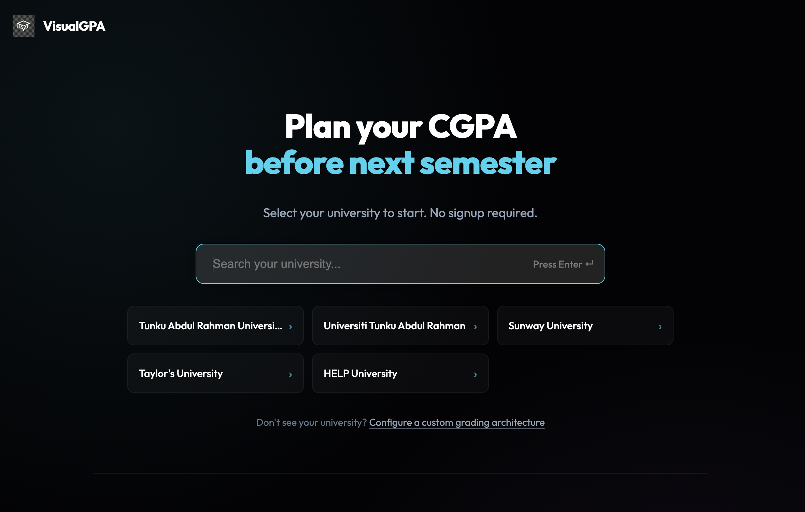

# Visual GPA


**Visual GPA** is a high-performance, privacy-focused CGPA calculator and academic planning tool designed for students. Built with a "privacy-first" architecture, it performs all calculations client-side, ensuring that sensitive grade data never leaves the user's device.

This project demonstrates a modern, component-driven approach to complex state management and responsive UI design using Next.js App Router and TypeScript.



---

## 🚀 Live Demo

**[Deployed Application: visualgpa.hqinglab.tech](https://visualgpa.hqinglab.tech/)**

---

## ✨ Features

-   **Privacy-First Architecture**: All data persistence happens in `localStorage`. No database required.
-   **Dynamic Grading Scales**: Decoupled grading policy logic allows support for multiple universities with different schemes (4.0, 4.3, 5.0 scales) without code changes.
-   **Predictive Analytics**: "What-if" scenario planning to visualize how future grades impact cumulative GPA.
-   **Reactive UI**: Real-time calculation updates as users type, with zero latency.
-   **Responsive Glassmorphism Design**: A custom-crafted, cyber-aesthetic UI that adapts seamlessly from desktop ultrawides to mobile devices.
-   **Smart Course Management**: Automatic detection of repeat courses based on course codes with configurable policy handling (Latest vs. Best attempt).

## 🛠 Tech Stack

-   **Framework**: [Next.js 15 (App Router)](https://nextjs.org/)
-   **Language**: [TypeScript](https://www.typescriptlang.org/) (Strict Mode)
-   **Styling**: Custom CSS Variables System & Glassmorphism Design
-   **State Management**: React Context + Hooks
-   **Analytics**: Google Analytics 4 (Privacy-conscious implementation)
-   **Deployment**: Vercel Edge Network

## 🏗 Architecture Overview

The system is designed with a strict separation of concerns between **Academic Policy** and **Calculation Logic**.

### Core Components
1.  **Data Layer (`src/data`)**: Drop-in **policy packs** under `src/data/packs/*`, aggregated by `registry.ts`. Add a university by creating one pack file and registering it — calculation engine stays untouched.
2.  **Logic Layer (`src/logic`)**: Pure functions — CGPA engine, target reverse-solve, classification, policy version resolve/snapshot, privacy-safe share encoding, import/export. Covered by Vitest (`npm test`).
3.  **UI Layer (`app/` + `src/components`)**: Workspace uses `useWorkspaceState` for persistence/scenarios; panels explain rules, compare plans, and share grade-free summaries via `#share=` hash.

### Directory Structure
```
├── app/                  # Next.js App Router (Routes & Layouts)
│   ├── [uni]/            # Dynamic University Workspace (SPA Root)
│   └── globals.css       # Global Design System & Variables
├── src/
│   ├── logic/            # Pure Calculation Engine (No UI dependencies)
│   ├── data/             # Static University configurations
│   ├── components/       # Reusable UI Atoms & Molecules
│   └── types.ts          # Shared TypeScript Interfaces
```

## 🧠 Key Engineering Decisions

### 1. Pure Functional Calculation Engine
The GPA calculator logic (`src/logic/calculator.ts`) is implemented as a pure function. It accepts `Course[]` and `AcademicPolicy` and returns a `CGPAResult`.
-   **Why:** This standardizes behavior across different universities. The same engine powers a 4.0 scale university and a 5.0 scale university just by swapping the configuration object.
-   **Benefit:** Enables unit testing of edge cases (e.g., repeated courses, "Withdrawn" grades) without mocking UI state.

### 2. Client-Side Persistence Strategy
Instead of a traditional database, the app uses `localStorage` for persistence.
-   **Why:** Grades are highly sensitive personal data. By keeping them strictly on the client, we eliminate data liability and server costs while ensuring fast load times.
-   **Scalability:** Allows the app to serve thousands of concurrent users on a static CDN without database bottlenecks.

### 3. Custom CSS Variable System
Rather than relying solely on utility classes, the project implements a semantic CSS variable system (`--bg-deep`, `--accent-cyan`, `--glass-border`).
-   **Why:** This enables instant "theming" and consistent glassmorphism effects that are hard to replicate with standard utilities. It also optimizes rendering performance by reducing the CSS bundle size compared to utility-heavy frameworks.

## ⚡ Performance Considerations

-   **Zero-Runtime CSS**: Critical styles are loaded via standard CSS, avoiding runtime overhead from CSS-in-JS libraries.
-   **Optimized Re-renders**: The calculation engine runs only when dependency arrays change, ensuring the UI remains crisp even with 50+ courses loaded.
-   **Static Generation**: University configuration pages are statically optimized, ensuring immediate Time-to-First-Byte (TTFB).

## 💻 Local Development Setup

To run this project locally:

1.  **Clone the repository**
    ```bash
    git clone https://github.com/yourusername/visual-gpa.git
    cd visual-gpa
    ```

2.  **Install dependencies**
    ```bash
    npm install
    ```

3.  **Run the development server**
    ```bash
    npm run dev
    ```

4.  Open [http://localhost:3000](http://localhost:3000) in your browser.

5.  **Run unit tests** (pure logic layer)
    ```bash
    npm test
    ```

To add another university without touching the calculator, see [docs/POLICY_PACKS.md](docs/POLICY_PACKS.md).

## 🔮 Future Improvements

-   **Cloud Sync**: Optional opt-in to sync data across devices using an encrypted user session.
-   **Transcript Parsing**: OCR or PDF parsing to auto-populate course lists from official transcripts.
-   **Degree Audit**: Integration with degree requirements to show "Progress to Graduation".

---

*Designed & Engineered by LAU HUI QING*
